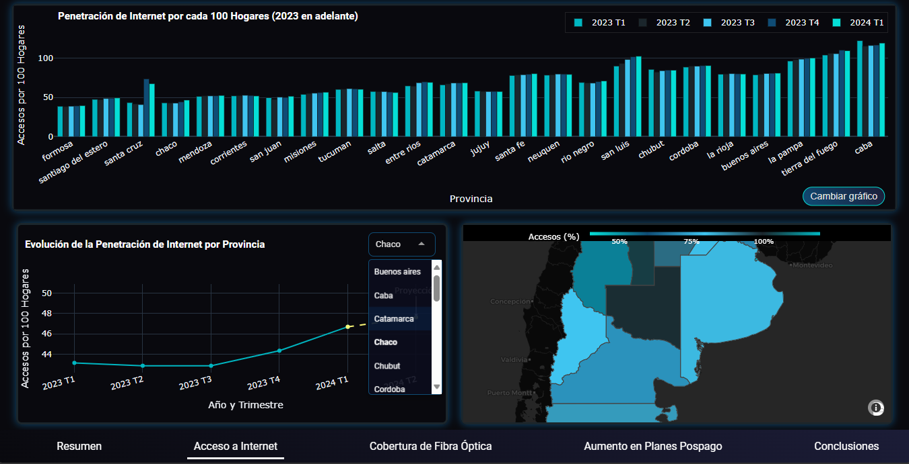
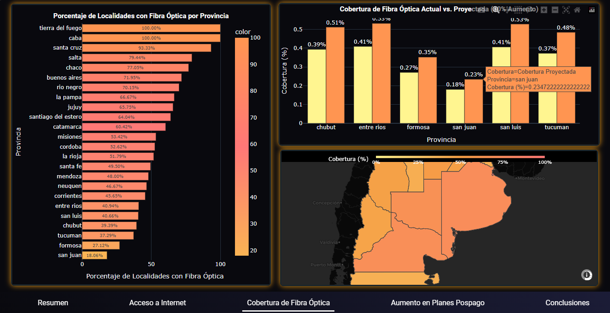
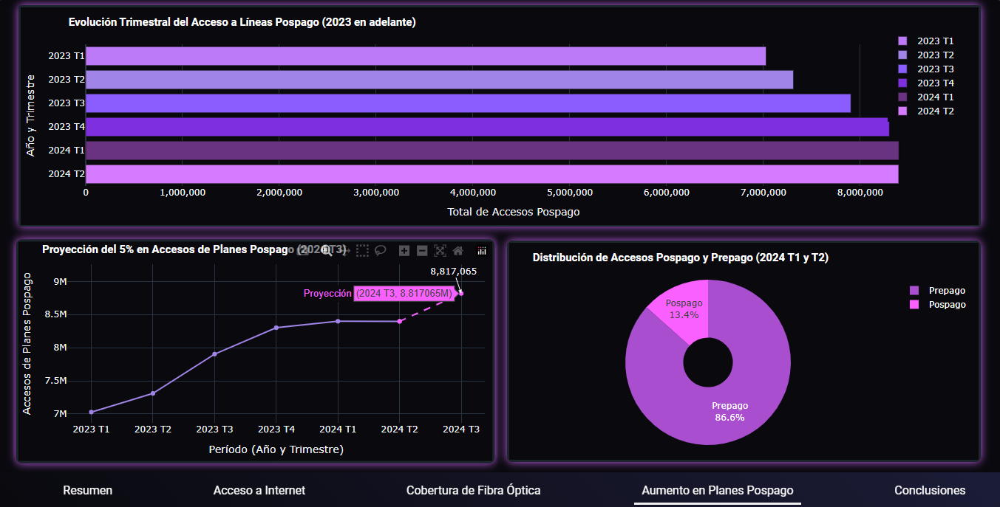

# 📊 Dashboard de Análisis de Conectividad en Argentina - Versión Dash

Este repositorio contiene una aplicación interactiva desarrollada con Dash para analizar la conectividad en Argentina. El dashboard se centra en tres KPIs clave, relacionados con la penetración de internet, la cobertura de fibra óptica y el uso de planes pospago. La app ofrece visualizaciones personalizadas, proporcionando insights valiosos para la mejora de la conectividad en distintas provincias.

## 🌐 Estructura de la App

La app se organiza en cinco secciones principales:

- **📈 Resumen General**: Visión general de los KPIs principales y estadísticas destacadas.
- **🌍 KPI 1 - Acceso a Internet**: Análisis detallado de la penetración de internet en hogares, mostrando el acceso promedio por provincia mediante gráficos de barras y líneas.
- **📶 KPI 2 - Cobertura de Fibra Óptica**: Evaluación de la cobertura de fibra óptica en las provincias, identificando áreas con menor cobertura y proyecciones de mejora.
- **📱 KPI 3 - Aumento en Planes Pospago**: Análisis del crecimiento en accesos a planes de telefonía móvil pospago, comparado con los planes prepago.
- **📌 Conclusiones y Recomendaciones**: Resumen de los hallazgos clave y recomendaciones para mejorar la conectividad, basadas en los tres KPIs analizados.

## 📦 Requerimientos

La app utiliza las siguientes librerías:

- `dash`: Framework principal para la creación de aplicaciones web interactivas.
- `dash_core_components`: Componentes esenciales para gráficos y controles.
- `dash_html_components`: Componentes HTML en Dash.
- `dash_bootstrap_components` (opcional): Para mejorar el estilo y diseño visual.
- `plotly`: Librería para generar gráficos interactivos.
- `pandas`: Manipulación y análisis de datos.
- `psycopg2`: Para la conexión a la base de datos PostgreSQL.

## 🗂️ Estructura del Código

- **app.py**: Archivo principal que carga y organiza las distintas páginas de la app.
- **paginas/**: Carpeta que contiene cada página modularizada de la app:
  - `resumen_general.py`: Página de resumen.
  - `kpi_1.py`: Página de análisis del KPI 1 - Acceso a Internet.
  - `kpi_2.py`: Página de análisis del KPI 2 - Cobertura de Fibra Óptica.
  - `kpi_3.py`: Página de análisis del KPI 3 - Aumento en Planes Pospago.
  - `conclusiones.py`: Página de conclusiones y recomendaciones.
- **data_loader.py**: Módulo para cargar datos desde la base de datos.
- **visualization.py**: Módulo para generar las visualizaciones utilizadas en cada KPI.
- **assets/**: Carpeta para archivos CSS y otros recursos visuales:
  - `base.css`: Estilos generales y tipografía.
  - `buttons.css`: Estilos para botones.
  - `graphs.css`: Estilos específicos para los gráficos.
  - `navbar.css`: Estilos para la barra de navegación.
  - `progress-bars-css`: Estilos de las barras de progreso
  - `kpi_cards.css`: Estilos para las tarjetas de KPI.
  - `animations.css`: Animaciones en los elementos interactivos.

## 💡 Notas

Este dashboard fue diseñado para proporcionar una interfaz visual amigable y elegante para el análisis de datos de conectividad en Argentina. Cualquier contribución o sugerencia es bienvenida para mejorar la funcionalidad y el alcance del análisis.

## 🖼️ Capturas de Pantalla

A continuación, se presentan algunas capturas de pantalla del dashboard en funcionamiento:

## 📬 Contribuciones

Las contribuciones para mejorar esta app son bienvenidas. Si tienes ideas para mejorar el código, el diseño visual o la estructura del dashboard, por favor, envía un pull request o abre un issue.

