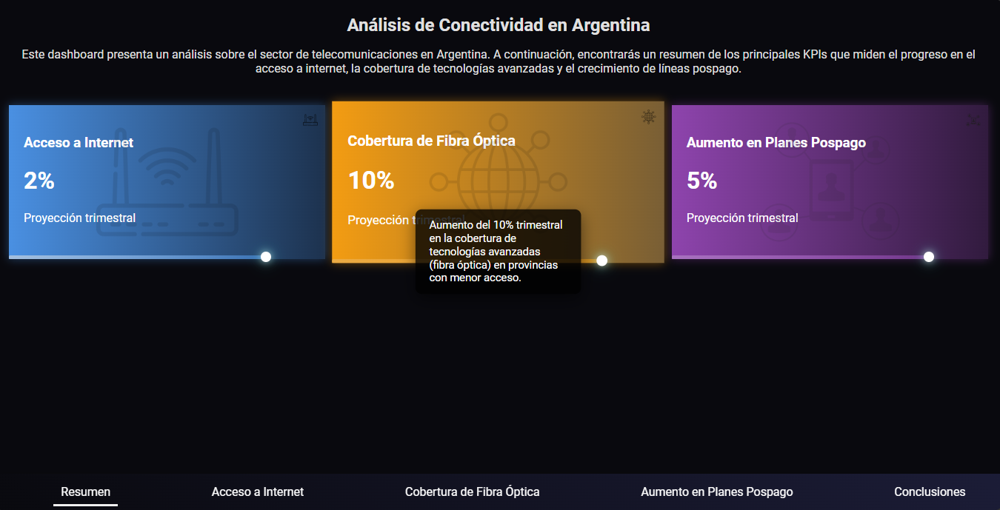
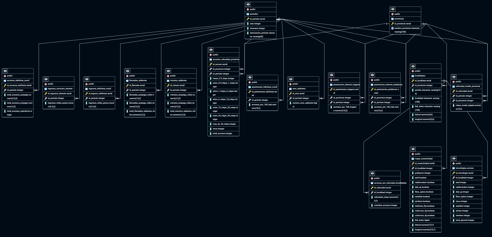

# **📡 Proyecto de Análisis del Sector Telecomunicaciones** 📡

## 🌐 **Contexto**

Este proyecto tiene como objetivo analizar el sector de las telecomunicaciones, abarcando los servicios de  **Internet** ,  **Telefonía Móvil** , y **Conectividad** en Argentina, utilizando diversas fuentes de datos provistas por organismos oficiales.

El análisis incluye:

* 🛠️ **Procesamiento de datos**
* 🗄️ **Creación de una base de datos SQL**
* 📊 **Construcción de un dashboard interactivo** para visualizar distintos KPIs y métricas relevantes.

## **Estructura del Proyecto**

- **📁 Notebooks/**: Jupyter Notebook que documentan el proceso de:
  - Extracción, Transformación y Carga de los Datos (ETL)
  - Análisis exploratorio de datos (EDA)
  - Creación de la Base de Datos SQL
- **📁 Dashboard_Dash/**:
  - Dashboard interactivo creado con Dash.
- **📁 Dashboard_Streamlit/**:
  - Dashboard interactivo creado con Dash.
- **📁 assets/: Archivos estáticos como imágenes y GeoJSON con el mapa de Argentina
- **📝 LICENSE**: Contiene la licencia MIT bajo la cual se distribuye este proyecto.

## 🎯 **KPIs Definidos**



### **📈 KPI 1: Aumentar el acceso a Internet en un 2% por provincia**

**Objetivo**: Aumentar en un 2% el acceso al servicio de internet por cada 100 hogares en el próximo trimestre, por provincia.

**Explicación**: Este KPI se enfoca en incrementar la penetración de internet a nivel provincial, con el objetivo de cerrar la brecha digital existente entre las distintas regiones del país. Para su proyección, se ha realizado un análisis trimestral de los accesos a internet en los hogares, visualizando la evolución histórica y calculando la proyección del 2% para el siguiente trimestre.

### **🌍KPI 2: Aumentar la cobertura de Fibra Óptica en un 10% en las provincias con menor cobertura**

**Objetivo:** Aumento del 10% trimestral en la cobertura de Fibra Óptica en provincias con menor cobertura.

**Explicación:** Se decidió enfocar este KPI en mejorar la infraestructura de Fibra Óptica, dado su impacto en la calidad y estabilidad de las conexiones a internet. Las provincias con menor cobertura de fibra fueron seleccionadas para ser objeto de mejoras, garantizando un crecimiento enfocado en cerrar la brecha de acceso a tecnologías avanzadas. Aunque se evaluó también la tecnología Wireless, se determinó que era necesario un análisis más profundo de la calidad de la infraestructura instalada antes de establecer un KPI de mejora específico en esa área.

### **📞 KPI 3: Incrementar en un 5% el acceso a líneas pospago**

**Objetivo:** Incrementar en un 5% el acceso a líneas pospago durante el próximo trimestre.

**Explicación:** Este KPI está orientado a fomentar la adopción de líneas pospago en Argentina, un tipo de servicio que tiende a ofrecer mejor calidad de servicio y estabilidad en la conectividad. Se realizó un análisis de la evolución trimestral de los accesos pospago y se proyectó un aumento del 5% para el tercer trimestre de 2024, basado en las tendencias históricas.

## **📋 Conclusiones y Recomendaciones sobre los KPIs**

### **📈 KPI 1: Aumentar el acceso a Internet en un 2% por provincia**

**📝 Conclusión:**

El análisis de la penetración de internet muestra que algunas provincias ya han experimentado un crecimiento estable en los últimos años. Sin embargo, regiones como el NEA y NOA requieren de **objetivos más profundos** que alcanzar un aumento del 2% trimestral.

**💡 Recomendación:**

Para  **cerrar la brecha digital** , es fundamental implementar **estrategias regionales específicas** que incluyan **incentivos** a proveedores de servicios de internet para expandir su cobertura en áreas rurales y menos conectadas. Dichas estrategias podrían basarse en **subsidios o financiamiento público-privado** para acelerar el desarrollo.

### **🌍 KPI 2: Aumentar la cobertura de Fibra Óptica en un 10% en las provincias con menor cobertura**

**📝 Conclusión:**

Hay un gran porcentaje de provincias con  **poca cobertura de Fibra Óptica** . Aumentar la cobertura en estas áreas debe ser una prioridad para cerrar la brecha de conectividad con **enfoques ajustados** a las situaciones de cada provincia, para garantizar una distribución más eficiente de los recursos e inversiones.

**💡 Recomendación:**

Se sugiere la implementación de un **programa escalonado** ajustado al contexto de cada provincia para reducir la brecha de conectividad. El aumento proyectado del 10% logra incrementar la cobertura en todas las provincias seleccionadas, pero **no es suficiente** como para llevar a ninguna a una cobertura mayoritaria.

Esto refuerza la **necesidad de inversión a largo plazo** para mejorar la infraestructura de fibra óptica, especialmente en las provincias más rezagadas.

### **📞 KPI 3: Incrementar en un 5% el acceso a líneas pospago**

**📝 Conclusión:**

El acceso a líneas pospago ha mostrado un  **crecimiento constante** , pero los planes prepagos siguen siendo la tendencia, debido a la **flexibilidad financiera** que ofrecen. El aumento proyectado del 5% es una  **dirección correcta** , pero se necesita **adoptar programas más atractivos** para atraer a los clientes prepagos y reducir la brecha entre usuarios prepagos y pospagos.

**💡 Recomendación:**

Para incrementar la adopción de líneas pospago, es necesario ofrecer **planes más flexibles y personalizados** que puedan adaptarse a las necesidades económicas de las zonas rurales. Incluir **beneficios adicionales** como descuentos en servicios y mayor conectividad a internet son incentivos que pueden ayudar a fomentar la adopción de estos planes.

## 🔄 **Proceso ETL**

Se realizó un proceso de **Extracción, Transformación y Carga (ETL)** de los datasets más relevantes del proyecto para estructurar los datos y preparar su análisis.

### 📁 **Datasets Utilizados:**

1. **🌐 Internet** : Contiene información sobre accesos a internet, velocidades de conexión, ingresos, penetración en hogares y población.
2. **📱 Telefonía Móvil** : Incluye información sobre llamadas, SMS, minutos consumidos, ingresos y penetración del servicio.
3. **🗺️ Mapa de Conectividad** : Proporciona datos sobre la conectividad en diversas localidades, incluyendo tecnologías de acceso y cobertura de red.

### 🚀 Proceso de ETL:

El proceso de ETL se aplicó a cada dataset por separado. A continuación se detallan las etapas del ETL para los datasets de Internet, Telefonía Móvil y Mapa de Conectividad:

1. **Internet** :

* Se procesaron y exportaron  **7 tablas** : `accesos_por_velocidad`, `accesos_tecnologia_localidad`, `accesos_velocidad_localidad`, `ingresos_servicios_internet`, `penetracion_internet_hogares`, `penetracion_internet_poblacion`, y `velocidad_media_provincia`.

2. **Telefonía Móvil** :

* Se procesaron y exportaron  **6 tablas** : `accesos_telefonia_movil`, `ingresos_telefonia_movil`, `llamadas_salientes`, `minutos_salientes`, `penetracion`, y `sms`.

3. **Mapa de Conectividad** :

* Se procesó una tabla llamada `mapa_conectividad`, que incluye información geográfica y de conectividad por localidad.

---

## 🛠️ **Arquitectura de la Base de Datos**

La base de datos creada en **PostgreSQL** será la fuente de este proyecto. Fue diseñada para garantizar la eficiencia y claridad en la integración de los datasets.

La siguiente imagen muestra el modelo entidad-relación (ERD). Este modelo ilustra cómo están estructuradas las tablas y las relaciones entre ellas:



### 🗄️ **Tablas Principales:**

1. **🌐 Internet**

* `accesos_por_velocidad_provincia`: Almacena los accesos a internet por velocidad de conexión y provincia.
* `accesos_tecnologia_localidad`: Almacena los tipos de acceso a internet por localidad (ADSL, cablemodem, fibra óptica, etc.).
* `accesos_por_velocidad_localidades`: Registra las velocidades de conexión disponibles por localidad.
* `ingresos_servicios_internet`: Detalla los ingresos obtenidos por los servicios de internet en miles de pesos.
* `penetracion_internet_hogares`: Almacena la penetración de internet por cada 100 hogares.
* `penetracion_internet_poblacion`: Almacena la penetración de internet por cada 100 habitantes.
* `velocidad_media_provincia`: Registra la velocidad media de bajada de internet por provincia.

2. **📱 Telefonía Móvil**

* `accesos_telefonia_movil`: Registra el acceso a la telefonía móvil por tecnología y localidad.
* `ingresos_telefonia_movil`: Detalla los ingresos por el servicio de telefonía móvil.
* `llamadas_salientes`: Almacena los datos sobre las llamadas salientes por periodo.
* `minutos_salientes`: Registra los minutos de llamadas salientes por provincia y periodo.
* `penetracion_telefonia_movil`: Registra la penetración de la telefonía móvil por provincia.
* `sms_salientes`: Almacena los SMS salientes por provincia y periodo.

3. **🗺️ Mapa de Conectividad**

* `mapa_conectividad`: Incluye información sobre la cobertura de diversas tecnologías de acceso (ADSL, fibra óptica, 4G, etc.) por localidad.

### 📚 **Tablas de Apoyo:**

1. **🏙️ Provincias** :

* `provincias`: Incluye los nombres únicos de las provincias.

2. **📅 Periodos** :

* `periodos`: Registra los distintos periodos de tiempo (Año y Trimestre).

3. **🏠 Localidades** :

* `localidades`: Almacena las localidades únicas, asociadas a sus provincias, con coordenadas de latitud y longitud.

En el modelo, se puede observar la estructura de las tablas principales (Internet, Telefonía Móvil, Mapa de Conectividad) y las tablas de apoyo (Provincias, Localidades, Periodos), así como las claves foráneas que definen las relaciones entre ellas.

---

## **⚙️ Normalización y Decisiones de Modelado**

Durante la creación de la base de datos, se tomaron las siguientes decisiones clave:

1. **División de las tablas**:
   Se crearon tablas de apoyo (Provincias - Localidades - Periodos) respondiendo a la necesidad de evitar redundancia de columnas iguales en distintas tablas.
2. **Normalización de nombres de provincias** :
   Se estandarizó el nombre de las provincias, convirtiéndolas a todas en minúsculas.

## 🔍 **Consideraciones Finales**

### **🌐Sobre el KPI de Wireless y Fibra Óptica:**

En el análisis inicial, se planteó mejorar la cobertura tanto de Fibra Óptica como de Wireless. Sin embargo, debido a la falta de información específica sobre la tecnología wireless instalada en cada provincia, no se ha podido evaluar con precisión si las conexiones corresponden a tecnologías avanzadas (como 5G o Wi-Fi 6) o versiones más antiguas. Por lo tanto, se ha decidido ajustar el KPI para centrarse únicamente en Fibra Óptica.

En el futuro, con más información detallada sobre la infraestructura wireless, sería posible proponer un KPI orientado a la mejora de tecnologías más avanzadas dentro de esta infraestructura.

### **📊Escalabilidad y Ajustes de los KPIs:**

Se ha dejado la puerta abierta a mejoras futuras, con KPIs ajustados a las realidades de cada provincia. Un enfoque escalable permitiría una distribución más eficiente de los recursos e inversiones, asegurando un desarrollo inclusivo y equilibrado en todo el país.

---

### 💻 **Instalación y Ejecución Local**

 **🧰 Requisitos**

- Python 3.10 o superior.
- Motor de base de datos: **PostgreSQL** .
- Instalar las dependencias listadas en requirements.txt:

```bash
pip install -r requirements.txt
```

**⚡ Pasos para Reproducir el Proyecto** :

- Crear un entorno virtual con las dependencias listadas en requirements.txt.

```bash
python -m venv nombre_de_tu_entorno
source env/bin/activate  # En Windows: env\Scripts\activate
```

- Clonar el repositorio.

```bash
git clone https://github.com/agustin-caceres/Proyecto-Data-Analyst
```

- Ejecutar los notebooks de ETL para obtener los datasets procesados.
- Cargar los datasets en la base de datos SQL.
- Ejecutar el análisis exploratorio de datos y generar las visualizaciones.

## **👨‍💻 Autor**

Este análisis fue desarrollado por **Agustín Cáceres.** 

Si tienes alguna pregunta o deseas discutir más sobre este proyecto, no dudes en contactarme a través de mi perfil en LinkedIn:

- [LinkedIn](https://www.linkedin.com/in/agustincaceres9/?lipi=urn%3Ali%3Apage%3Ad_flagship3_profile_view_base%3Bxtefa1AKSzaNAj74ALdMEg%3D%3D)

## 📂 **Fuentes de Datos**

Los datos utilizados en este proyecto provienen de fuentes oficiales provistas por el Ente Nacional de Comunicaciones (ENACOM), la autoridad encargada de la regulación del sector de telecomunicaciones en Argentina. Estos datos incluyen información detallada sobre accesos a internet, penetración de servicios, ingresos y tecnologías de conexión a nivel nacional.

Para acceder a los datasets originales, puedes visitar el sitio web de ENACOM:

[Visita ENACOM aquí](https://indicadores.enacom.gob.ar/datos-abiertos).

## 📜 Licencia

Este proyecto está licenciado bajo los términos de la licencia MIT. Para más información, consulta el archivo:

- [LICENSE](LICENSE)
